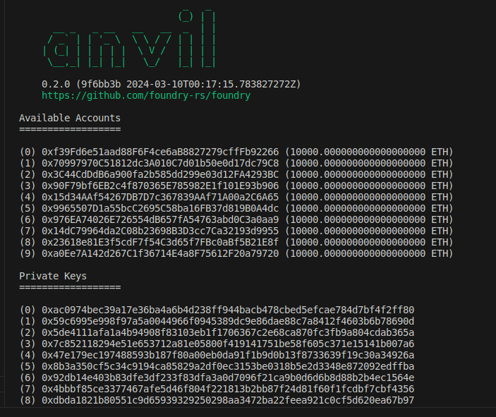
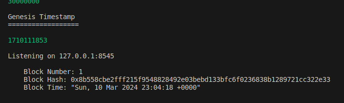
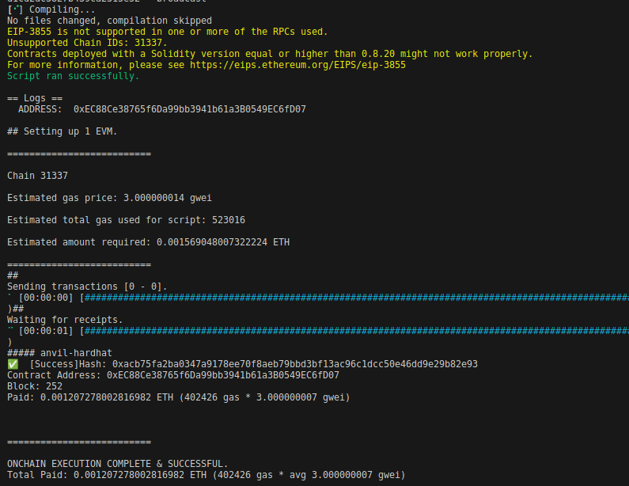
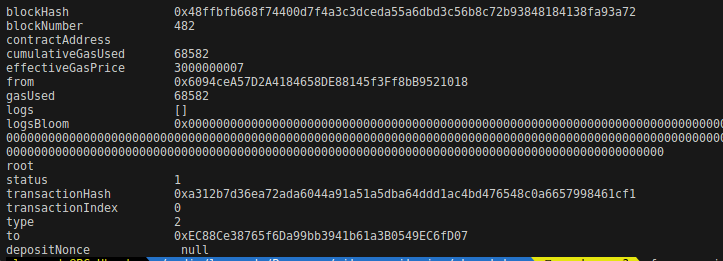

# Foundry Token ERC20 Akno - AKN

This is a repository with learning purposes to record my first experiments with Solidity, using Foundry as base to interact with local and remote testnets.

**Foundry is a blazing fast, portable and modular toolkit for Ethereum application development written in Rust.**

Foundry consists of:

-   **Forge**: Ethereum testing framework (like Truffle, Hardhat and DappTools).
-   **Cast**: Swiss army knife for interacting with EVM smart contracts, sending transactions and getting chain data.
-   **Anvil**: Local Ethereum node, akin to Ganache, Hardhat Network.
-   **Chisel**: Fast, utilitarian, and verbose solidity REPL.

- Documentation: https://book.getfoundry.sh/

---

# Token ERC20 Akno 'AKN'

The ERC20 Akno 'AKN' token is my implementation of EIP-20 for leaning purposes. The token's contract can be deployed using the follow steps:

## Local testnet

- Run `anvil` CLI to start the local blockchain with mining blocks within 5 seconds, or use your frequency preference. Let this terminal opened and aside, showing all the interactions your local blockchain has from now.

```
anvil -b 5
```




Copy one of the private and public key pair generated by `anvil`. It will be used as your wallet through the next steps and is already loaded with needed local testnet ETH token.
Also, copy the local ip address and port that `anvil` is broadcasting your local testnet. You will have to use it as the RPC int the next steps, adding "**http://**" before the ip address.

- Run `forge` to deploy the AKN token contract using the `Akno.s.sol` script. 

```
forge script script/Akno.s.sol:AknoScript \
    --rpc-url <your-rpc-address> \
    --private-key <private-key-selected> \
    --broadcast
```



Now, the AKN token is deployed in your local testnet and it contract address is logged on terminal, copy it to further interations. At the moment of deploying, none token is minted. 

- Run `cast send` to interact with token contract, using the `mint` function. 

```
cast send \
    --rpc-url <your-rpc-address> \
    --private-key <private-key-selected> \
    <your-token-contract> "mint(address, uint256)()" 0x0000000000000000000000000000000000000000 1000000000000000000 
```



The last two arguments from above command are, respectively, a blank address used to inform `mint` function that is supposed to mint tokens to contract owner (see the function source code) and the value of `1e18`, or `10**18` (equals a single unity of AKN token, because of decimal settled as 18 at the contract constructor).

- Run `cast call` commands to call different contract functions.

```
cast call \
    --rpc-url <your-rpc-address> \
    --private-key <private-key-selected> \
    <your-token-contract> "totalSupply()(uint256)"
```
